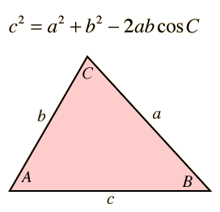

A PID controller is a feedback control loop that uses three values to modify it's output. This allows the the system's output to be precise. Another advantage of using a PID controller is the ability to quickly change its values.
PID stands for Propotional Integral Derivative. In our case, these three mathematical operations manage the direction of the car.

  By performing three seperate operations on the error: multiplying it by a constant (k), taking the integral of the error over time, and taking the derivative of the error of time, and then adding all three quantities together, a value for the direction can be obtained.
  
  One way of gathering data to calculate the error value is to average a range Lidar data projected onto a surface. However, this method can be computationally expensive, so one way that I found to gain a more accurate representation of the surface your are trying to follow is to use the distance of two vectors projected onto the wall by using the law of cosines. 
  

You can reference an example of a PID controller in the file "PIDExample.py"
