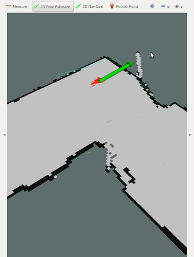
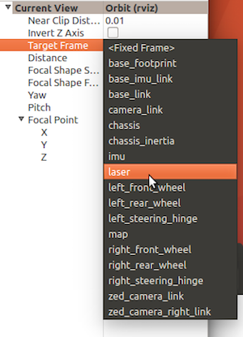

# Particle Filter Localization
**Note: These instructions assume you have installed the Particle Filter according to [these](http://bwsi-racecar.com/maps/localization/particle_filter_installation/) installation instructions.**
### Running Localization
(1). If you have followed the installation instructions as intended, the maps the particle filter uses will be in "~/localization/localization_ws/src/maps". Assuming you have a ".pgm" file and a ".yaml" file in your "~/mapfile" folder, then you can copy all these files with: `cp ~/mapfiles/* ~/localization/localization_ws/src/maps`.<br>
(2). To select which map to use for localization, you'll need to modify your "map_server.launch" file in "~/localization/localization_ws/src/launch". You may need to chmod it to edit it. Launch files essentially tell `roslaunch` how to run nodes in a package. The modification is simply replacing "basement_fixed.map.yaml" with the name of your ".yaml" file.<br>
(3). Now we can get cooking! In the car's terminal, run `teleop`.<br>
(4). Then in another tab/window, run:
```bash
  source ~/localization/localization_ws/devel/setup.bash
  roslaunch particle_filter localize.launch
```
* After the program prints "…Received first LiDAR message," it should start to print "iters per sec: 20  possible: 21" to confirm that it is getting scan data and making localization estimates.
* Debugging tips:
  - We found that it is usually necessary for the vesc to be running completely (i.e. there’s a good Traxxas battery) in order for this to work.
  - If the `roslaunch` starts launching, but then returns an error message like <font color="A00000">"cannot locate node of type particle_filter"</font>, it likely means that the "particle_filter.py" file in "~/localization/localization_ws/src/" needs executable permissions. You can give it these permissions by running `chmod +x particle_filter.py`.
  - If the `roslaunch` raises errors regarding "rangelibc", it likely means that the "rangelibc" installation failed. Try it again according to our instructions [here](http://bwsi-racecar.com/maps/localization/particle_filter_installation/). Maybe the "setup.py" file in "~/localization/range_libc/pywrapper/" needs executable permissions.

(5). Also, just as with cartographer, you may open RViz. Interesting topics to try will be /map, /scan, and /pf/viz/particles topics. See step 7 of the "Running off of live data" section of the [Cartographer page](http://bwsi-racecar.com/maps/cartographer/cartographer_usage/#running-off-of-live-data) for how to add topics in RViz.
 * Again, rviz can be finicky at times. If nothing appears even after running teleop or playing the rosbag, try changing the "Fixed Frame" to "map". Then check and uncheck the the checkboxes for the topics you are interested in. If that didn't work, try re-running Rviz. Check that you are running the programs you need to run.<br>
(6). The car likely does not know where it is starting on the map. Give it an estimate of where it is using the "2D Pose Estimate" tool.<br>



* Click on the map for position, drag for orientation.<br>
* If you want to be extra fancy, you can have the car do this itself, by publishing a [PoseWithCovarianceStamped](http://docs.ros.org/api/geometry_msgs/html/index-msg.html) message to the /initialpose topic. You can see what these messages look like by running `rostopic echo /initialpose` and doing a 2D pose estimate in RViz. 
* A good idea would be to place the car in a fixed starting position and publish this *known* position to "/initialpose" when you press a button. Then you could press another button to change state and start running.

(7). (optional) Don’t like your view locked to (0,0,0)? Make it follow the car by changing your frame to something on the car.<br>


  * First use the "Focus Camera" tool and click near the pose estimates (red arrows) to center the view on the car initially.</li>
  * Then change "Target Frame" to something on the car to keep up with the car’s changes in position. The "laser" (LIDAR) or "base_link" are good things to follow.
  
(8). Want to know where you are in this world while you're writing your code? Subscribe to <del>PewDiePie</del> pf/viz/inferred_pose!<br>


<font color="AA0000" size="4"><b> This is where you get the pose estimate of where the car is on the map! </b></font>


  * To extract meaningful data from these messages, you can figure it out on your own.
  * Use `rostopic type` to see what datatype the messages are. Once you have the name, you can find more info on [ros.org](http://docs.ros.org/api/geometry_msgs/html/index-msg.html).
  * Or just use `rostopic echo`.
  * If you receive a ros message in a python program and are unsure of what it is, try printing it out.
  * Quaternions Help (if you think angular info will help)
  You may have noticed the rotations for these ROS geometry messages are encoded in quaternions. Why? I really don’t know, but it allows us to track the car’s rotation from -2π to 2π. If you care to amuse yourself for a few minutes, feel free to look up quaternions and derive the conversion back to an angle. Y'all are smart. Or you may just use the ROS’s built-in transformations:
```python
    from tf.transformations import euler_from_quaternion
    . . .
    def quatToAng3D(quat):
        euler = euler_from_quaternion((quat.x,quat.y,quat.z,quat.w))
        return euler
```
  For reference, roll = `euler[0]`, pitch = `euler[1]`, yaw = `euler[2]`, and yaw is rotation about the z-axis.

<details><summary><h3>Google Cartographer Localization</h3></summary>
Basically, Chris wrote some stuff, unfortunately, it ended up not being helpful because Google Cartographer is darn dense and we haven't fully figured it out. Either that, or it's just plain wonk. Wonk means bad. Either way, I didn't have the heart to delete Chris's hard work (but I did have the heart to edit it and make it correct as possible), and besides, maybe some really ROS-y or Google-y person will one day find this helpful...<br>
To run localization in Google Cartographer, you won't need an image and an ".yaml" file, but rather this diddly doo-dad called a ".pbstream" file. Here's how you get this thing:
  
1. `cd` into the folder you want your ".pbstream" stored.
2. Run `roslaunch cartographer_ros offline_racecar_2d.launch bag_filenames:=${HOME}/bagfiles/<your_rosbag_name>.bag`<br>
&ensp; Warning: this will pull up an rviz window, so whoops if you're ssh-ed in.<br>
3. Wait for the bag to finish playing, then watch the terminal and wait until it's done "optimizing".
Now you wanna localize. Here's how you do something like that (though it also tries to make another map, which is concerning; maybe you need to modify one of the config files to include `max_submaps_to_keep = 3`, as the [Google Cartographer website](https://google-cartographer-ros.readthedocs.io/en/latest/going_further.html) suggests):
4. Run the localization by entering the following `roslaunch cartographer_ros demo_racecar_2d_localization.launch \ load_state_filename:=${HOME}/<path_to_file>/<my_file_name>.pbstream`.
5. We don't really know where to get pose data. And if you wanted to give the program pose estimated, good stinkin' luck, buddy. The best we can offer is intercepting stuff sent across the "tf" topic. While the localization is running, enter `rostopic echo tf`. The "base_link" frame may have relevant data.

<h4> Change log (how did we concoct some of those launch and configuration files):</h4>
1. Copy the launch file demo_backpack_2d_localization.launch and rename it by entering `cp demo_backpack_2d_localization.launch demo_racecar_2d_localization.launch`.
&ensp; Within this new file change robot_description to "$(find xacro)/xacro '$(find racecar_description)/urdf/racecar.xacro'")"
&ensp; Configuration_basename becomes racecar_2d_localization.lua
&ensp; Don't remap from "echoes". Instead:
&ensp; Remap from /odom to /vesc/odom
&ensp; Remap from imu to /imu/data
2. Delete the robag node.

3. First, enter `cp offline_backpack_2d.launch offline_racecar_2d.launch`
Also, change the "configuration_basename" argument from backpack_2d.lua to racecar_2d.lua
Delete the "urdf_basename" parameter entirely.
Don't remap from "echoes". Instead:
remap from /odom to /vesc/odom
remap from imu to /imu/data
</details>
