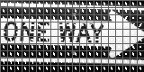
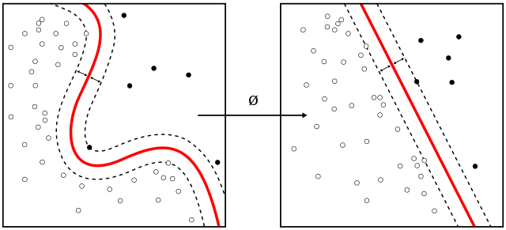

# Histogram of Oriented Gradients (HOG)

If interested in the entire background of the algorithm, the [paper is here](http://lear.inrialpes.fr/people/triggs/pubs/Dalal-cvpr05.pdf).

This algorithm extracts key features from an image or set of images. It builds this based on the most extreme gradient changes between pixels, which are then grouped into cells for an aggregate weight and direction. Intuitively, these features are strongest around the edges of objects and pixel intensity changes.

An example **HOG descriptor**:

 

# Support Vector Machines (SVM)

This is a **supervised machine learning** method, depending on labeled training data. Based on the provided data, an SVM tries to find an optimal hyperplane (based on user parameters) to separate data points into unique classes. Optimal, in this case, is focused on separating clusters of data while maximizing the distance from those points - known as maximizing the `margin` of the training data. The hyperplane is built in N-dimensional space, and our model will be staged in 2-D or 3-D space, depending on parameters.

A **nonlinear** SVM on the left, and a **linear** SVM on the right:

# HOG-SVM Interaction

The data points are feature vectors in our case. The feature vectors built by the HOG are fed into the SVM, where they are separated into classes of feature vectors.
*** More to come ***

