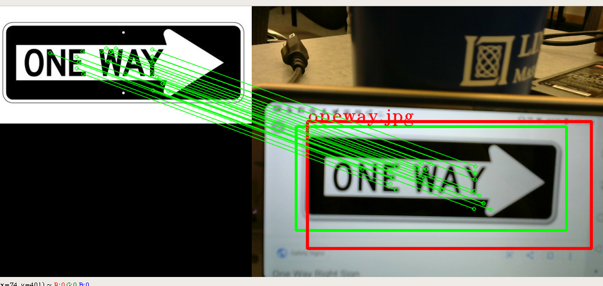
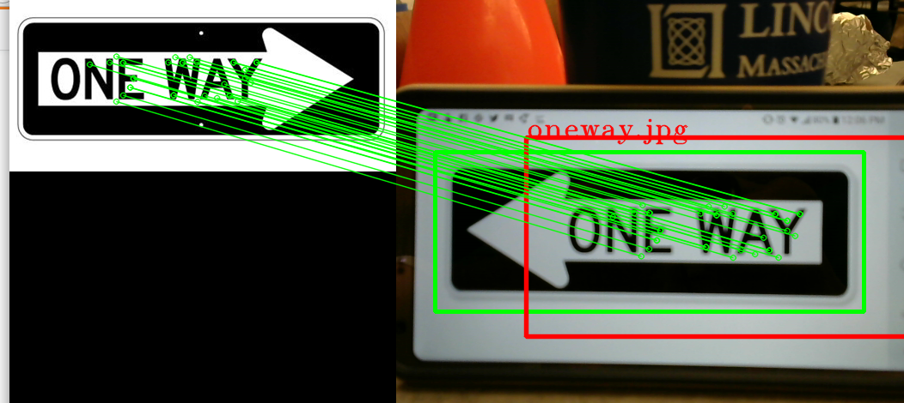

## Midweek Challenge: Cone and Sign Parking

For this week's first challenge, we'll simulate your car driving down a street, turning into a parking lot, and parking in a designated spot. Your car will have to do two things:

1. Read the direction of the sign and turn in that direction
2. Spot the orange cone and park in front of it

These two things can be developed independently of each other; our recommendation is that half of your team tackles the first task and the other tackles the second task. You can then combine the code into one node. Reading the sign will require reading some documentation, writing some openCV, and working a bit more with python, while the parking will deal with an extension of yesterday/today's drive-stop.

## Sign Detection
For sign detection, we will be using feature detection in the form of the SIFT (Scale-Invariant Feature Transform) algorithm and color detection. 

**You will need to uninstall opencv and install a new, developer opencv called Contrib. You uninstall opencv using ```pip uninstall opencv-pthon``` and install it using ```pip install opencv-contrib-python==3.4.2.16```

You will be tasked with implementing the color/shape detection in turnRectStarter.py. Read through the code's comments; we have linked to openCV documentation that will help you write this code.  **Read every comment in the file**. This code is only designed to run on your laptop; once you can verify that it works on your laptop you can keep moving forward.

Example run:
python turnRectStarter.py -i ./images/oneway.jpg -l "One-Way-Sign" -s 0

-i tells the program what image to get
-l is a lowercase l that tells what to label the detected object
-s tells them the source of camera, just like slider_colorSegmentation.py

### Changing turnRectStarter.py and driveNode.py to work with ROS
The images from the Zed camera and openCV images sadly do not work too well with each other. That means we will have to change some stuff so that it works with ROS. First, we have to get rid of the source code inside turnRectStarter.py (the code that takes in images from the camera). We can delete any cv2.VideoCapture() function within the code. You can also delete any part that has the cam.read() function (including the loop it is in) and set "frame" to be a passed-in image (that means you need to alter the function to take in an extra parameter "source"). Then, you can delete any cv2.imshow(), cam.release, cv2.destroyAllWindows(), and cv2.waitKey(). 

Finally, make a variable for your two bounding boxes, which the function will now return. Find the two instances of cv2.rectangle(), which will key you in to what the bounding box coordinates are and where they are stored, and set your bounding box variable equal to these coordinates.

We will now look at driveNode.py to see how the images are passed in. Go into your __init__ function and find the self.camera_data variable. That variable holds the camera data from the Zed camera. Looking further down at the callback function, you can see that cd_color_segmentation takes in self.camera_data.cv_image. This is the Zed image that has been molded to work with openCV, so that is what you will be passing into sift_det() as your source image. Notice that sift_det takes in an image apart from the source(the one way sign image in this case) so make sure you pass in the location of the one-way image into the sift_det call.

If you get confused, the implementation of the sift_det function should be very similar to the implementation of the cd_color_segmentation function except for the extra "comparison" image. 

**MAKE SURE YOU IMPORT SIFT_DET CORRECTLY AT THE TOP OF THE FILE**
### Interfacing with driveNode.py
As you did yourself, sift_det returns two bounding boxes, one of the overall sign and another that draws a box around the color and shape that you specified.

Here are the bounding boxes that we got from running sift_det on rway:


Here are the bounding boxes that we got from running sift_det on lway:


Its up to you to figure out how to compare the two bounding boxes to figure out what sign you are seeing.

## Parking
Your task is to have the car drive up to the cone and park in front of it! You will need to build upon the code in driveNode.py since parking is just an extension of drive-stop. As you write your code, make sure you **START SMALL and SIMPLE** as a sanity check. If your simple code works, you can build up to more complicated things.

You should try to get the cone to sit between the car's wheels and have the car stop within a meter of the cone; penalties will be given for failing to satisfy these conditions.

If you finish this code before your opencv teammates finish, you can start working on how the robot will know to switch between looking for the cone/looking for the sign and how the robot will react when it figures out the direction of the sign.
