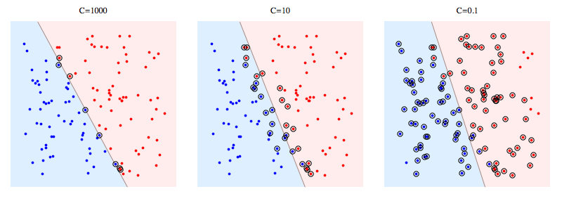

# Directory Setup

Download this zip file [here on Google Drive](https://drive.google.com/drive/folders/1nYBKs9f-GPLYbjyUQ_5N842WaqQleNei?usp=sharing) onto your computer.

After a full setup, your folder directory should look like this:

```bash
| - hog-svm
    |-TrainHOG.cpp
    |-detector.py
    |-batchRename.py
    |-feedSaver.py
    |-howToBuild.txt
    |-makefile
    |-positiveTrainingImages
        |-[your images]
    |-negativeTrainingImages
        |-[your images]
    |-processedPosTrainingImages
        |-[cropped and renamed posImages]
    |-processedNegTrainingImages
        |-[cropped and renamed negImages]  
```

You must make the positiveTrainingImages / negativeTrainingImages directories yourself.


# How to Use

### Collecting data

We recommend having at least 100 postives images of your object (for example, a Right Way Sign), and at least 100 negative images. A good rule is to always have at least as many negative images as positive images.

```
    - Positive images: Consists of your object of interest as the center of attention. 
                       Crop and adjust the images to focus on your object, where the image essentially acts as a Region of Interest (ROI) in which the HOG algorithm will build a feature vector from.

    - Negative images: Images that do not contain your object of interest. 
                       A rule of thumb is not choose purely random pictures as negatives, but images that represent backgrounds/environments in which the model will or may be used in.
```

Provided are two simple helper Python scripts for image preprocessing (commands to run are found near the top of the files):

```
    - batchRename.py: Copies, then renames and resizes all images within a given directory, saving these new images in a separate directory.

    - feedSaver.py: Using a camera feed, it saves a specified number of frames from the feed as images, within a specified directory. 
                    Use the letter 'e' key to start saving frames from the feed, and 'ESC' to quit the stream.
                    By default saves the images as .png, but can be changed to other image formats (ex. .jpg).
```

### Choosing ML parameters

For both the Histogram of Gradients (HOG) and Support Vector Machine (SVM), there are several parameters to be chosen to optimize your integrated model.

For HOG (line 131, parameter in hog.compute(), in TrainHOG.cpp) :

```
    winstride : Window stride, a tuple of two values, determines the step size of the sliding 
    padding   :
```

Full documentation is [here](https://docs.opencv.org/3.0-beta/modules/ml/doc/support_vector_machines.html).
More info on SVM types [here](http://www.statsoft.com/textbook/support-vector-machines), useful for the `SVM-Type` parameter.
For SVM - main parameters (starting line 387, parameter in SVM, in TrainHOG.cpp):

```
    gamma       : Manipulates the data in 3-D space, making it easier to separate the data non-linearly, at the cost of data distortion as gamma grows.
    kernel Type : Determines the Kernel function used for separating classes. The key methods are linear vs. nonlinear seperation, depending on the datasets.                             
    C           : Determines the degree of leninence for misclassification of classes in the model. The higher the C value, the more the model will try to not misclassify the HOG feature vectors.                  
    SVM Type    : Determines whether the SVM focuses on classification error minimization vs. regression error minimization.  
```




### Training data

Once there is a positive and negative dataset formatted, we can compile our model via the single C++ file - TrainHOG.cpp.
Compilation is more complicated Windows, requiring separate software from Microsoft called `MSVC` (an IDE). We recommend the people on the group with Mac OS X and Native Linux machines to compile the C++ code. Check if the machines have `g++` installed, though most machines have it by default.

If not installed:

    $ sudo apt-get update

    then

    $ sudo apt install g++

We have provided a `makefile` to simplify the commands for object file linking and executable construction, so to use the C++ code, in your terminal:

```bash
    1. Type `make` in the directory containing the `makefile`.

    2. Type `./TrainHOG` to see what flags are available and how to run your executable. The `./` is how C++ executable files are run.
       An example of a command would be 

            $ ./TrainHOG -dw=160 -dh=80 -pd=./posImages -nd=./negImages -fn="TrafficDet160x80.xml" -v True

    3. The output file will be your model, in XML format. This will be loaded into `detector.py` for use with Python.
```


